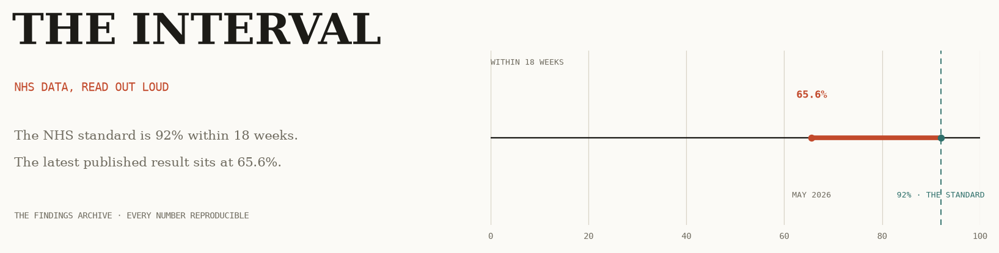

<picture>
  <source media="(prefers-color-scheme: dark)" srcset="assets/the-interval-header-dark.png">
  
</picture>

# The Interval · the findings archive

This repository is the reproducibility archive behind **The Interval**, an
independent analysis project built on NHS England's open referral-to-treatment
(RTT) data. The NHS Constitution promises that the interval between referral
and treatment is no more than 18 weeks. The published data records what that
interval actually is, trust by trust and specialty by specialty. Each finding
on the site reads that gap from a different angle, and every finding leaves
its full working here.

Nothing in the archive is a black box: if a number appears on the site, it
can be rebuilt end-to-end from the files in this repository.

## How the archive is organised

One folder per finding, and each folder is a verified reproducibility
pack with the same layout:

```
finding-XX/
  analysis/    the Python pipeline that produces every figure and statistic
  data/        lightweight data directory; large source extracts are documented in SOURCES.md
  figures/     matplotlib outputs, rendered to The Interval's figure spec
  outputs/     the derived summary tables quoted in the text
  README.md    the finding's notes: status, series, scope, and reproduction
```

The packs contain verified derived outputs, figures, and canonical analysis scripts. Large NHS England extracts remain external to keep the upload lightweight; each pack’s SOURCES.md records the direct URLs, local paths, hashes, scope, and retrieval notes.

## Reproducing a finding

Step into any finding and run its pipeline:

```bash
cd finding-01
python analysis/make_figures.py
```

Every figure lands in `figures/` and every derived table in `outputs/`.
Requires Python 3.10+ with `duckdb`, `pandas` and `matplotlib`; the source extracts listed in each pack’s `SOURCES.md` must be present at the documented project paths.

## The figure specification

Every chart in the archive is drawn to the same restrained visual code used on
the site: ink for structure, vermilion for the observed gap, and dashed teal
for the 92% standard. Duration charts label the 18-week boundary explicitly.
The header image uses the same 65.6% to 92% promise-versus-reality scale as
the site masthead. It is generated by
`assets/make_header.py` if you ever want to redraw it.

## Data source and vintage

All analysis uses NHS England's consultant-led Referral to Treatment waiting
times, published as monthly statistical press notices on england.nhs.uk. The
series is restated each month, so every output is quoted against its
publication month; a figure is never floating free of its vintage.

## Stack

Python · DuckDB · pandas · matplotlib.
Analysis and writing: [Haroon Ayaz](https://github.com/Kyojur0).
Independent work, not affiliated with the NHS.
